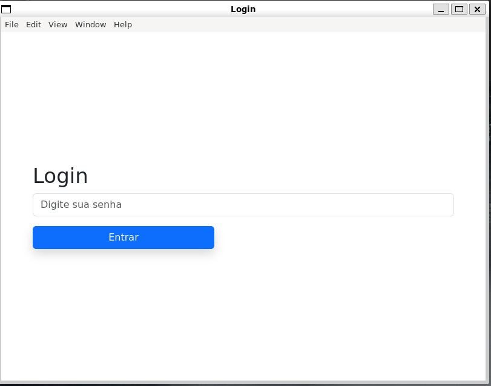
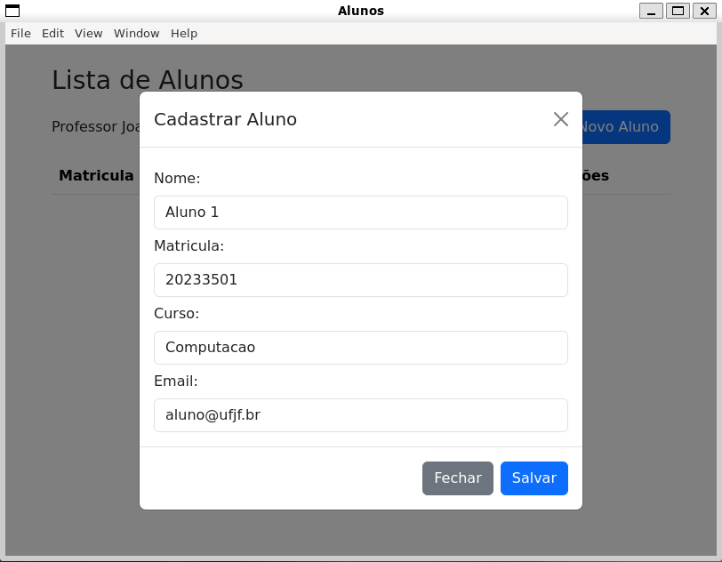
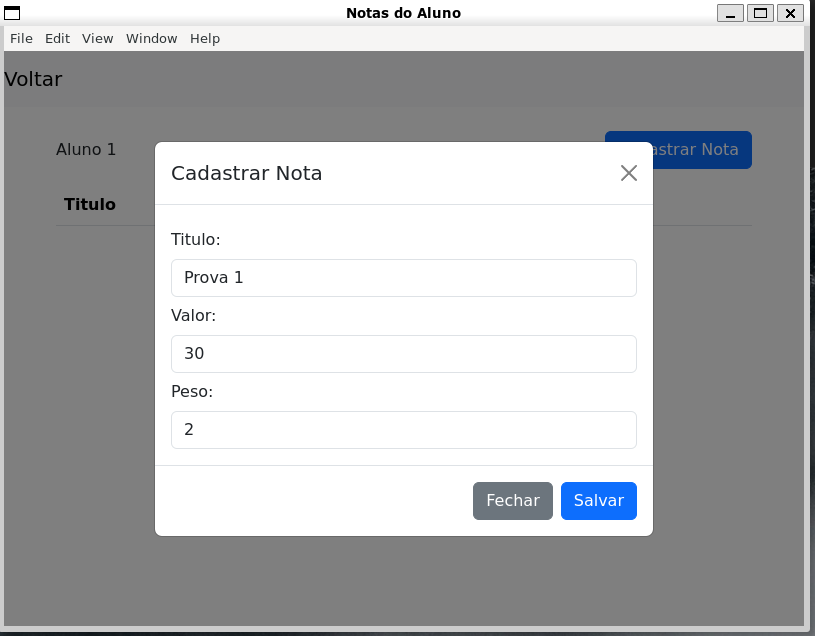
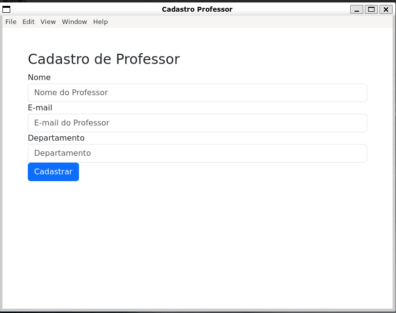

# SIGA v2 (um pouco melhor)

**Disclaimer:** Infelizmente só vi ao requisito da implementação em java quando era tarde demais (na especificação técnica cita apenas que deve ser uma linguagem orientada a objetos, fui ver que estava especificado java somente agora no final), já tinha implementado tudo em JS e não daria tempo de refatorar para java. Mesmo assim, o projeto aplica os conceitos de orientação a objetos e design patterns ensinados na disciplina.

Essa é a v2 do projeto, a versão inicial foi desenvolvida em  Typescript e é extremamente mais complexa e completa (um clone do SIGA em escala real com quase todas as features), implementando autenticação jwt, integração com banco de dados postgres e dockerização. Consegui quase finalizar a implementação, mas como não daria tempo de implementar o frontend para deixar mais "utilizável" decidi abandonar e fazer essa versão mais simples em electron.

[Siga V2 API em typescript e escala real](https://github.com/cabraljv/sigav2-ts)

## Preview

## O que é o SIGA?

O SIGA como todos conhecemos é um sistema que permite gerenciar a vida academica dos docentes e discentes da UFJF. O sistema é utilizado para gerenciar matriculas, notas, frequencias, etc. O sistema é utilizado por todos os cursos da UFJF, e é um sistema que é utilizado por todos os alunos e professores da UFJF.

## O que é o SIGA v2?me@cabraljv.de

É uma pequena abstração de toda a complexidade presente no SIGA com as principais features necessárias.

## Features

- [x] Login
- [x] Cadastrar professores
- [x] Cadastrar alunos
- [x] Consultar alunos de um professor
- [x] Cadastrar notas para um aluno
- [x] Consultar notas de um aluno

## Informações importantes

- O sistema foi desenvolvido utilizando o electron e valina JS apenas.
- O sistema foi desenvolvido para a disciplina de Programação Orientada a Objetos.
- Utilizei o storage do electron para armazenar os dados em formato JSON.

## Dependencias
- Node 16.x ou superior

## Como rodar o projeto?

- Clone o projeto
- Instale as dependencias com `yarn install`
- Rode o projeto com `yarn start`

## Como utilizar o sistema?

> O login de admin é: *admin*

Para logar como professor basta entrar com o email do professor cadastrado.

[Especificações](./Especificacoes.md)

## Licença

MIT

Made with 💜 by [João Victor Cabral](
  https://github.com/cabraljv
) 